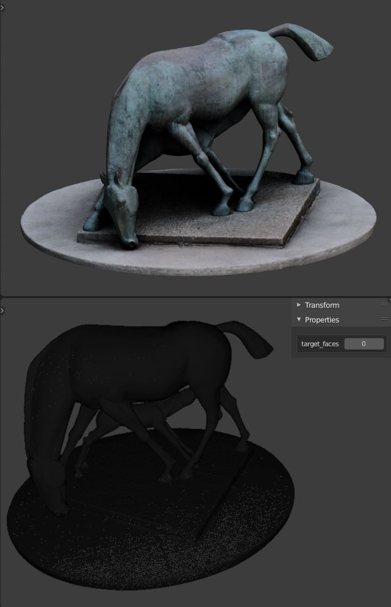
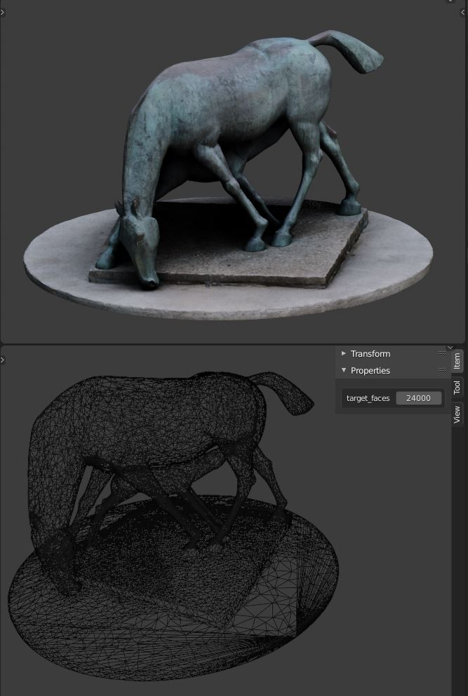
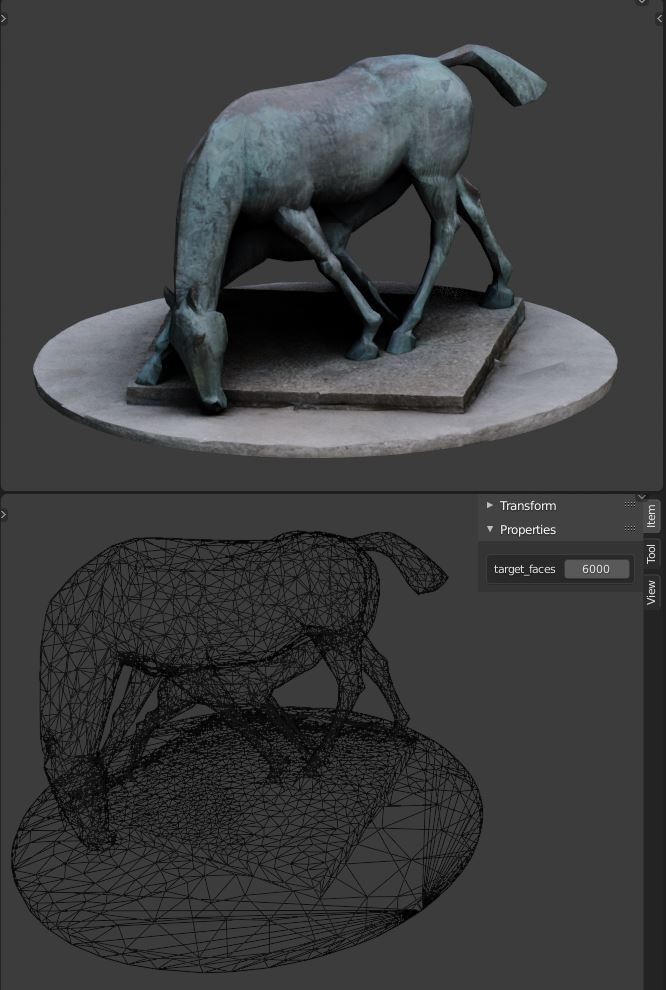
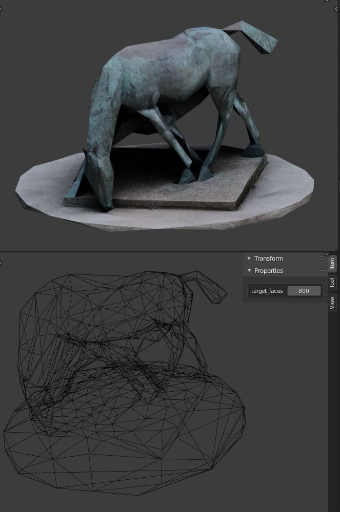

# Batch convert gltf files into blend format
A script to batch convert gltf to blend format and apply some cleaning operations automatically, and reduce the number of polygons

The purpose of this script is to batch convert models gotten from various sources, from the gltf format, into a blend file.

Blender is a free and open-source software for 3D modelling (and a lot of other things !!)

It is advised to start from a blank file. All objects in the file when the batch conversion begins will be deleted and purged.

Go to File > Import > Batch Import Gltf Files

Navigate to your root folder. There should be subfolders inside this folder that resemble this (the converter will look for gltf files recursively, so it doesn't matter if there are several level deeps of subfolders) :

Each one of this folders needs to have this hierarchy inside : 

You can tweak a few properties in the right hand side of the import popup window :

  - Save in subfolders : If checked, blend files will be saved in the individual subfolders. Otherwise they will be saved in the root folder
  - Overwrite files : If checked, blend files already present in the folder will be overwritten. Usefull to prevent re-converting files that have already been converted previously
  - Remove Backup : If checked, this will prevent creating a backup file which extension ends in .blend1 afterwards. This helps prevent duplication of files when re-converting files when the overwrite parameter is checked.
  - Target faces : This is the amount of faces your final object will have. Set to 0 to keep the same number (See below)
  - Apply decimate : Destructively apply the decimate modifier and set the number of faces
  - Unpack textures : Unpack the textures in a sub folder. If unchecked, will pack textures into blend file
  - Scale : Scale the model by this amount if you happen to know that your imported files need to be scaled by a constant factor
  - Expected maximum dimension : This helps re-scaling objects to match an expected dimension. eg if importing humans, the 

Warning and Info messages will be printed in the system console : Window > Toggle System Console (recommended to do it beforehand because the script will lock the interface and Blender will be unresponsive for the time being)

Click on the Blue button to run the conversion tool.

Each file will be cleaned a little bit :
  - Translation will be reset
  - Mesh objects will be joined into one
  - Double vertices will be merged
  - A decimate modifier will be added to lower the poly count

When the converting is finished, you can tweak the amount of faces by using a custom property on the object. 0 means no downsizing.

With a big number of files, it can happen that the conversion fails after some time. Simply re-run the conversion and uncheck "Overwrite files". 

